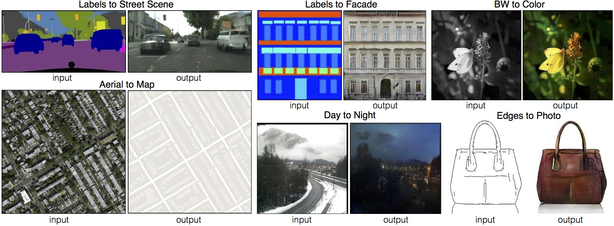

# pix2pix
[Project](https://phillipi.github.io/pix2pix/) | [Arxiv](https://arxiv.org/abs/1611.07004) |[PyTorch](https://github.com/junyanz/pytorch-CycleGAN-and-pix2pix)

Torch implementation for learning a mapping from input images to output images, for example:



Image-to-Image Translation with Conditional Adversarial Networks  
 [Phillip Isola](http://web.mit.edu/phillipi/), [Jun-Yan Zhu](https://www.cs.cmu.edu/~junyanz/), [Tinghui Zhou](https://people.eecs.berkeley.edu/~tinghuiz/), [Alexei A. Efros](https://people.eecs.berkeley.edu/~efros/)   
 CVPR, 2017.

On some tasks, decent results can be obtained fairly quickly and on small datasets. For example, to learn to generate facades (example shown above), we trained on just 700 images for about 2 hours (on a single Pascal RTX3080 GPU). However, for harder problems it may be important to train on far larger datasets, and for many hours or even days.

**Note**: Please check out our [pix2pix](https://github.com/junyanz/pytorch-CycleGAN-and-pix2pix),this origin this project code.

## Setup

### Prerequisites
```bash
conda create -n pointct python=3.6
conda install pytorch==1.8.0 torchvision==0.9.0 torchaudio==0.8.0 cudatoolkit=11.1 -c pytorch -c conda-forge
pip install -r requirements.txt
or
conda install -f environment.yml
```
## Train
```bash
python train.py --data_root train_path --name project_name --model pix2pix --direction origin_to_target -checkpoints_directory checkpoints_directory
```
Switch `origin_to_target` to `target_to_origin` to train translation in opposite direction.


## Test
```bash
python test.py --data_root test_path --name project_name  --model pix2pix --direction origin_to_target --checkpoints_directory checkpoints_directory --results_directory results_directory
```

This will run the model named `project_name` in direction `origin_to_target` on all images in `/path/to/data/val`.

Result images, are saved to `./results/project_name` (can be changed by passing `results_directory=your_directory` in test_options.py).

## Setup Training and Test data
### Generating Pairs
We provide a python script to generate training data in the form of pairs of images {origin,target}, where origin and target are two different depictions of the same underlying scene.

Create folder `/path/to/data` with subfolders `origin` and `target`. `origin` and `target` should each have their own subfolders `train`, `val`, `test`, etc. In `/path/to/data/origin/train`, put training images in style origin. In `/path/to/data/target/train`, put the corresponding images in style target. Repeat same for other data splits (`val`, `test`, etc).

Corresponding images in a pair {origin,target} must be the same size and have the same filename, e.g., `/path/to/data/origin/train/1.jpg` is considered to correspond to `/path/to/data/target/train/1.jpg`.

Once the data is formatted this way, call:
```bash
python datasets/combine_origin_and_target.py --fold_origin /path/to/data/origin --fold_target /path/to/data/target  --fold_origin_target /path/to/data
```

This will combine each pair of images (origin,target) into a single image file, ready for training.


